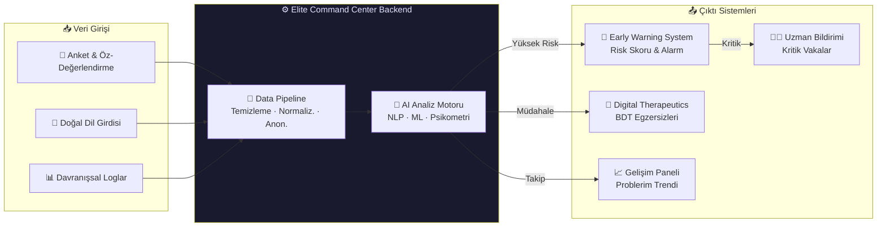
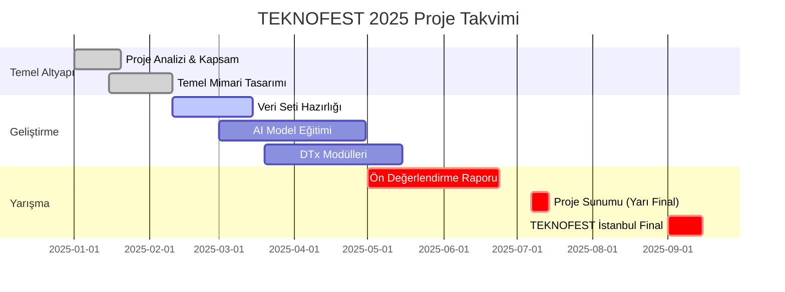

<div align="center">

# 🧠 TEKNOFEST 2025: Psikolojide Teknolojik Uygulamalar
### Elite Command Center · Mental Health Innovation Hub


[](https://teknofest.org)
[](https://teknofest.org)
[](https://www.python.org/)
[](https://github.com/bahattinyunus)
[](LICENSE)

[](https://github.com/bahattinyunus/teknofest_piskolojide_teknoloji)
[](https://github.com/bahattinyunus/teknofest_piskolojide_teknoloji)

</div>

---

## 📌 Projenin Özü (Mission Statement)

Bu proje, **TEKNOFEST 2025 Psikolojide Teknolojik Uygulamalar Yarışması** kapsamında geliştirilmektedir. Temel amacımız; modern yazılım mimarileri, yapay zeka ve kanıta dayalı psikolojik yaklaşımları harmanlayarak **ruh sağlığı alanında yenilikçi, erişilebilir ve ölçeklenebilir** dijital çözümler üretmektir.

> [!IMPORTANT]
> Projemiz; yüksek stres altındaki bireylerin **psikolojik dayanıklılığını** güçlendirmeyi, kriz öncesi riskleri **erken tespit** etmeyi ve bilimsel temelli **dijital terapötik müdahaleler** sunmayı hedefler.

---

## 🔥 Neden Bu Proje? (Problem Statement)

Dünya Sağlık Örgütü verilerine göre küresel çapta **1 milyar** kişi bir ruh sağlığı bozukluğundan etkilenmektedir. Türkiye'de ise işgücünün **%40'ından fazlası** mesleki tükenmişlik belirtileri sergilemektedir. Mevcut sistemlerin yetersizlikleri:

| 🚫 Mevcut Sorun | ✅ Bizim Çözümümüz |
| :--- | :--- |
| Psikolog başına düşen hasta sayısı çok yüksek | **AI destekli erken uyarı** human-in-the-loop ile yük azaltır |
| Standart anket yöntemleri statik ve geç kalır | **Gerçek zamanlı davranışsal patern** analizi |
| Terapi hizmetlerine erişim coğrafi & maddi engel | **Web tabanlı, 7/24 erişilebilir** platform |
| Kullanıcı uyumu (adherence) düşük | **Gamefikasyon & kişiselleştirilmiş DTx** modülleri |
| Veri gizliliği endişeleri | **KVKK & HIPAA** uyumlu anonim işleme |

---

## 🏛️ Sistem Mimarisi (System Architecture)



---

## 🧩 Modüller ve Özellikler (Core Modules)

### 1. 🛡️ Koruyucu Ruh Sağlığı Birimi
> *"Fırtına gelmeden önce uyar."*

- **Psikolojik Dayanıklılık Skoru:** Connor-Davidson Resilience Scale (CD-RISC) prensiplerini kullanan, sürekli güncellenen dinamik skor sistemi.
- **Early Warning System (EWS):** NLP tabanlı duygu analizi + davranışsal patern tanıma ile tükenmişlik, akut stres ve anksiyete sinyallerinin **t-0 tespiti**.
- **Risk Sınıflandırması:** `DÜŞÜK / ORTA / YÜKSEK / KRİTİK` 4 kademeli risk katmanı ile özelleştirilmiş müdahale protokolleri.

### 2. ⚡ Müdahale ve Destek Sistemi
> *"Doğru anda, doğru müdahale."*

- **Digital Therapeutics (DTx):** Bilişsel Davranışçı Terapi (BDT) protokollerine dayalı; günlük nefes egzersizleri, bilişsel yeniden yapılandırma ve mindfulness modülleri.
- **HCI Tasarım Felsefesi:** Bilişsel yük teorisi (Cognitive Load Theory) prensipleriyle tasarlanmış, stres azaltan **Glassmorphism UI**.
- **Gamefikasyon Motoru:** Kullanıcı uyumunu artırmak için rozet, seri ve ilerleme sistemi.

### 3. 📊 Bilimsel Ölçüm Laboratuvarı
> *"Veriye dayalı psikoloji, kör tahmin değil."*

- **Psikometrik Veri Hattı:** PHQ-9, GAD-7, PSS-10 gibi klinik ölçeklerin dijital adaptasyonu ve otomatize puanlama.
- **Digital Twin Değerlendirme:** Bireyin psikolojik profilinin zaman serisi analizi ile longitudinal takibi.
- **Model Kalibrasyon Döngüsü:** A/B test altyapısı ile sürekli model iyileştirmesi.

---

## 🔬 Bilimsel Temeller (Scientific Foundation)

Proje, kanıta dayalı psikolojik çerçeveler üzerine inşa edilmiştir:

| Teori / Model | Uygulama Alanı |
| :--- | :--- |
| **Bilişsel Davranışçı Terapi (BDT)** | DTx modüllerinin egzersiz içeriği |
| **PERMA Modeli** (Pozitif Psikoloji) | Dayanıklılık skoru bileşenleri |
| **Lazarus Stres-Başa Çıkma Modeli** | EWS'in risk faktörü ağırlıklandırması |
| **Yerkes-Dodson Eğrisi** | Performans-stres ilişki modelleme |
| **Psikolojik Güvenlik Teorisi** | UX tasarım prensipleri |

> [!NOTE]
> Tüm algoritmalar, DSM-5 ve ICD-11 tanı kriterleriyle uyumlu olacak şekilde tasarlanmıştır. Proje klinik bir tanı aracı değil, **koruyucu** ve **destekleyici** bir dijital sağlık platformudur.

---

## 🛠️ Teknoloji Yığıtı (Technology Stack)

| Katman | Teknoloji |
| :--- | :--- |
| **Core Logic** |  3.10+ |
| **NLP & Duygu Analizi** |  Transformers · BERT-TR |
| **ML Modelleme** |    |
| **Veri İşleme** |   |
| **Frontend / UI** |   Glassmorphism |
| **Güvenli Depolama** |  AES-256 şifreleme |
| **DevOps** |   |

---

## 📁 Depo Yapısı (Repository Structure)

```bash
teknofest_piskolojide_teknoloji/
├── 📁 configs/           # YAML/JSON sistem konfigürasyonları (model parametreleri, eşik değerleri)
├── 📁 data/
│   ├── raw/              # Ham psikometrik veri setleri
│   ├── processed/        # Temizlenmiş & normalleştirilmiş veriler
│   └── models/           # Eğitilmiş model ağırlıkları (.pkl, .h5)
├── 📁 docs/
│   ├── research/         # Bilimsel referanslar ve makaleler
│   └── api/              # API dokümantasyonu
├── 📁 src/
│   ├── 📁 analysis/      # Psikometrik veri analizi modülleri
│   ├── 📁 models/        # AI/ML model implementasyonları
│   │   ├── ews.py        # Early Warning System motoru
│   │   ├── nlp_engine.py # NLP & duygu analizi
│   │   └── resilience.py # Dayanıklılık skoru hesaplayıcı
│   ├── 📁 dtx/           # Digital Therapeutics egzersiz motoru
│   ├── 📁 ui/            # Frontend bileşenleri & Glassmorphism arayüz
│   ├── 📁 utils/         # Yardımcı fonksiyonlar, loglama, şifreleme
│   └── main.py           # 🚀 Elite Command Center — ana giriş noktası
├── .gitignore
├── CHANGELOG.md          # Sürüm değişiklik günlüğü
├── CONTRIBUTING.md       # Katkı rehberi
├── LICENSE               # MIT Lisansı
└── requirements.txt      # Proje bağımlılıkları
```

---

## 🚀 Hızlı Başlangıç (Quick Start)

### Ön Gereksinimler
- Python **3.10+**
- pip veya conda
- Git

### Kurulum

```bash
# 1. Depoyu klonlayın
git clone https://github.com/bahattinyunus/teknofest_piskolojide_teknoloji.git
cd teknofest_piskolojide_teknoloji

# 2. Sanal ortam oluşturun (önerilen)
python -m venv venv

# Windows:
venv\Scripts\activate
# macOS/Linux:
source venv/bin/activate

# 3. Bağımlılıkları yükleyin
pip install -r requirements.txt

# 4. Uygulamayı başlatın
python src/main.py
```

> [!TIP]
> İlk çalıştırmada `configs/settings.yaml` dosyasından model eşik değerlerini ve bildirim tercihlerinizi düzenleyebilirsiniz.

---

## 🎯 Rakip Analizi (Competitor Analysis)

Proje, TEKNOFEST kategorisindeki diğer projeler ve global ruh sağlığı uygulamaları analiz edilerek konumlandırılmıştır.

### 📋 Referans Kaynaklar
- 🔗 **[TEKNOFEST Şartnamesi 2025](https://www.teknofest.org/tr/competitions/competition/75)** — Koruyucu ruh sağlığı, VR, AI, Mobil odağı
- 🔗 **[PsychoPy](https://github.com/psychopy/psychopy)** — Açık kaynak bilişsel deney platformu  
- 🔗 **[GitHub/Psychology-Tools](https://github.com/topics/psychology)** — Global psikoloji teknoloji ekosistemi

### ⚖️ Karşılaştırmalı Analiz

| Özellik | Rakip Çözümler | **Elite Command Center** |
| :--- | :---: | :---: |
| Gerçek zamanlı risk tespiti | ❌ | ✅ |
| Klinik ölçek entegrasyonu | Kısmi | ✅ Tam |
| Kanıta dayalı DTx modülleri | ❌ | ✅ BDT tabanlı |
| KVKK/HIPAA uyumu | ❌ | ✅ |
| Gamefikasyon & kullanıcı uyumu | ❌ | ✅ |
| Türkçe NLP desteği | ❌ | ✅ BERT-TR |
| Donanım bağımlılığı | VR gerekli | ✅ Sıfır |

---

## 🗺️ Yol Haritası (Road Map)



---

## 🌟 Temel Özellikler Özeti

<div align="center">

| 🧠 AI-Powered | 🔒 Güvenli | 📱 Erişilebilir | 🎮 Gamified |
|:---:|:---:|:---:|:---:|
| NLP + ML modelleri | AES-256 şifreleme | Web tabanlı platform | Rozet & Seri sistemi |
| Gerçek zamanlı analiz | KVKK / HIPAA uyum | 7/24 kullanılabilir | Kişiselleştirilmiş deneyim |

</div>

---

## 👨‍💻 Geliştirici (Author)

<div align="center">

### Bahattin Yunus Çetin
**IT Architect · AI Enthusiast · Mental Health Tech Pioneer**

*"Teknoloji ve insan psikolojisinin kesişim noktasında, toplumun refahını artıracak dijital araçlar geliştiriyorum."*

[](https://github.com/bahattinyunus)
[](https://linkedin.com/in/bahattinyunus)

</div>

---

## 📜 Lisans & Katkı

Bu proje **MIT Lisansı** altındadır. Katkıda bulunmak için [CONTRIBUTING.md](CONTRIBUTING.md) dosyasını inceleyin.

---

<div align="center">

*"Teknolojiyi zihinleri iyileştirmek ve insanları bir araya getirmek için kullandığımızda en güçlü halini alır."*

<br>

[](https://teknofest.org)
[](https://github.com/bahattinyunus)

</div>
