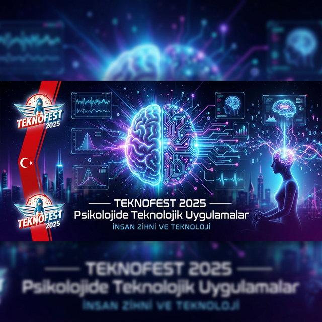
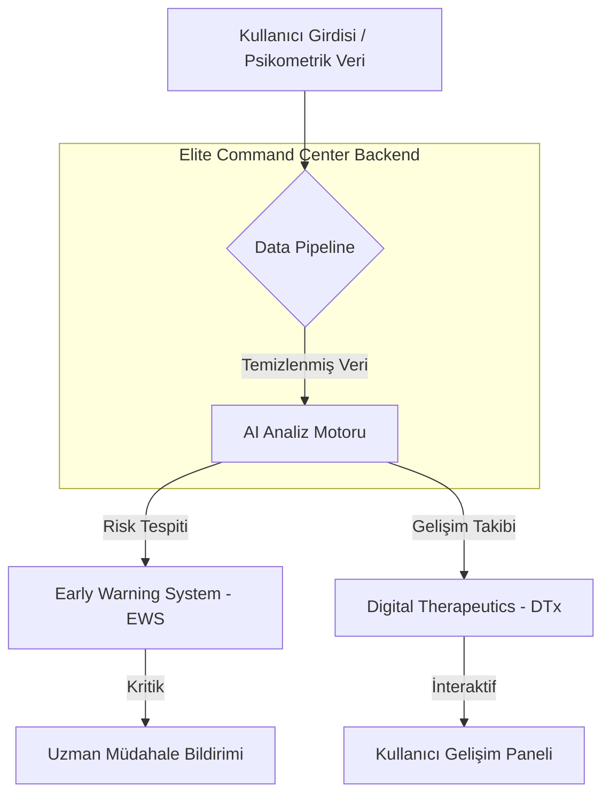

#  TEKNOFEST 2025: Psikolojide Teknolojik Uygulamalar
##  Elite Command Center | Mental Health Innovation Hub



[](https://teknofest.org)
[](https://teknofest.org)
[](https://www.python.org/)
[](https://github.com/bahattinyunus)
[](LICENSE)
[](https://github.com/bahattinyunus)

---

##  Mission Statement
Bu proje, **TEKNOFEST 2025 Psikolojide Teknolojik Uygulamalar Yarışması** kapsamında geliştirilmektedir. Temel amacımız, modern yazılım mimarileri ve yapay zeka entegrasyonları ile ruh sağlığı alanında yenilikçi, erişilebilir ve ölçeklenebilir çözümler üretmektir.

> [!IMPORTANT]
> Projemiz, koruyucu ruh sağlığı odaklı olup, özellikle yüksek stresli çalışma ortamlarındaki bireylerin psikolojik dayanıklılığını artırmayı hedefler.

---

## 🏛️ System Architecture

Projenin veri akışı ve modüler yapısı aşağıda görselleştirilmiştir:



---

##  Project Architecture & Modules

### 1. 🛡️ Koruyucu Ruh Sağlığı Birimi
*   **Psikolojik Dayanıklılık Analizi:** Kullanıcıların stres seviyelerini, duygu durum değişimlerini ve adaptasyon kapasitelerini ölçümleyen dinamik makine öğrenmesi algoritmaları.
*   **Early Warning System (EWS):** Doğal Dil İşleme (NLP) ve patern tanıma kullanarak risk potansiyeli taşıyan davranışsal eğilimlerin (tükenmişlik, anksiyete artışı vb.) önceden tespiti.

### 2. ⚡ Müdahale ve Destek Sistemi
*   **HCI (Human-Computer Interaction):** Bilişsel yükü azaltan, odaklanmayı artıran ve terapi süreçlerini destekleyen premium cam (glassmorphism) arayüz mimarisi.
*   **Digital Therapeutics (DTx):** Bilişsel Davranışçı Terapi (BDT) ilkelerine dayalı, interaktif ve kişiye özel dijital egzersiz modülleri.

### 3. 📊 Bilimsel Ölçüm Laboratuvarı
*   **Psychometric Data Analytics:** Psikometrik verilerin yüksek doğrulukla işlenmesi ve standartlaştırılması.
*   **Digital Twin Evaluation:** Geleneksel psikolojik değerlendirme yöntemlerinin dijital ikizleri üzerinden simülasyonu ve validasyonu.

---

## 🔬 Bilimsel Temeller (Scientific Foundation)

Proje, sadece teknolojik bir araç değil, aynı zamanda kanıta dayalı psikolojik yaklaşımlar üzerine inşa edilmiştir:
- **Bilişsel Davranışçı Terapi (BDT):** Modüllerin interaktif yapısı, düşünce-duygu-davranış döngüsünü normalize etmeye odaklanır.
- **Pozitif Psikoloji:** Dayanıklılık (resilience) modülü, bireyin güçlü yanlarını keşfetmesine yönelik PERMA modeli prensiplerini kullanır.
- **Veri Güvenliği:** Psikometrik veriler, HIPAA ve KVKK standartlarında şifrelenerek anonim bir şekilde işlenir.

---

## 🛠️ Technology Stack

| Bileşen | Teknoloji / Kütüphane |
| :--- | :--- |
| **Core Logic** |  |
| **AI/ML Engine** |    |
| **UI/UX** |   |
| **Data Storage** |  (Encrypted) |

---

##  Repository Structure
```bash
  configs/          # YAML/JSON tabanlı sistem konfigürasyonları
  data/             # Psikometrik ham veri setleri ve eğitim verileri
  docs/             # Bilimsel makaleler, şartname ve dokümantasyon
  src/              # Kaynak Kod (Core Logic)
     analysis/     # Psikometrik veri analizi modülleri
     models/       # AI/ML Model implementasyonları (MLP, Random Forest vb.)
     ui/           # Frontend / Interface bileşenleri
     utils/        # Yardımcı fonksiyonlar ve loglama
     main.py       # Elite Command Center ana giriş noktası
  requirements.txt  # Proje bağımlılıkları
```

---

## 🚀 Hızlı Başlangıç (Quick Start)

### Gereksinimler
- Python 3.10+
- Virtualenv (Önerilen)

### Kurulum
```bash
# Depoyu klonlayın
git clone https://github.com/bahattinyunus/teknofest_piskolojide_teknoloji.git

# Proje dizinine gidin
cd teknofest_piskolojide_teknoloji

# Sanal ortam oluşturun ve aktif edin
python -m venv venv
source venv/bin/activate  # Windows için: venv\Scripts\activate

# Bağımlılıkları yükleyin
pip install -r requirements.txt

# Uygulamayı başlatın
python src/main.py
```

---

## 🎯 Rakip Analizi ve Pazar Araştırması (Competitor Analysis)

Bu proje, **TEKNOFEST Psikolojide Teknolojik Uygulamalar** kategorisindeki diğer projeler ve global ölçekteki açık kaynaklı/ticari ruh sağlığı uygulamaları referans alınarak geliştirilmiştir. Aşağıda mevcut pazarın ve rakiplerin analizi, teknolojik altyapıları ve bizim projemizin öne çıkan farkları listelenmiştir.

### 1. Referans Kaynaklar ve Şartnameler
*   **[TEKNOFEST Psikolojide Teknolojik Uygulamalar Şartnamesi](https://www.teknofest.org/tr/competitions/competition/75)**: Yarışma, koruyucu ruh sağlığı, psikolojik dayanıklılığı artırma ve dijital terapi/ölçüm metodları (VR, AI, Mobil) geliştirmeyi hedefler. 2024 ve 2025 süreçlerinde yapay zeka entegrasyonu ön plandadır.
*   **Açık Kaynaklı Psikometri Araçları**: Bilişsel psikoloji analizleri için kullanılan global standartlardaki bağımsız kütüphaneler (Örn: [PsychoPy](https://github.com/psychopy/psychopy), [GitHub/Psychology-Tools](https://github.com/topics/psychology)).

### 2. Pazardaki Benzer Uygulamalar ve Yaklaşımlar
Github ve pazar ekosistemindeki benzer çözümler çoğunlukla 3 ana başlıkta toplanmaktadır:
1.  **AI Chatbot ve Duygu Tanıma:** Depresyon ve stres tespiti üzerine geliştirilen sohbet robotları *(Örn: MyMind benzeri açık kaynak terapi asistanları)*. Çoğunlukla sadece sentiment analizinde kalmakta, tıbbi geçerliliği es geçebilmektedir.
2.  **Dijital Psikometrik Test Platformları:** IPIP-NEO-PI (Big Five) gibi kişilik testlerini dijitale aktaran projeler. Bunlar genellikle statik veri sunar, devamlı takip eksiği yaşarlar.
3.  **Sanal Gerçeklik (VR) Destekli Terapiler:** Maruz bırakma (exposure) terapileri ve anksiyete yönetimi için başarılı ancak donanım maliyeti nedeniyle kitle erişiminden uzak projelerdir.

### 3. Bizim Avantajlarımız (Elite Command Center Farkı)
Rakiplerde tespit edilen *izole çalışma, maliyet/donanım bağımlılığı ve yetersiz bütüncül takip* problemlerine karşılık sistemimiz şu özelliklerle fark yaratır:
*   **Bütüncül ve Dinamik Mimari:** Sadece bir test aracı veya chatbot olmak yerine; *Erken Uyarı Sistemi (EWS)* ve *Digital Therapeutics (DTx)* ile tam bir döngü sağlayan koruyucu ruh sağlığı altyapısı.
*   **Modern Data Analytics Pipeline:** Geleneksel anket bazlı sistemlerin kısıtlarını aşmak için; Scikit-learn ve TensorFlow ile desteklenen sürekli, yüksek doğruluklu algoritmalar.
*   **Premium HCI (İnsan-Bilgisayar Etkileşimi):** Sıkıcı ve yorucu hastane arayüzleri yerine, motivasyon artırıcı, stres azaltan *Glassmorphism UI* tasarımı.

---

##  Road Map
- [x] Proje Analizi ve Kapsam Belirleme
- [x] Temel Mimari Tasarımı
- [ ] Veri Seti Hazırlığı
- [ ] AI Model Eğitimi & Optimizasyonu
- [ ] Yarışma Sunumu ve Prototip Yayını

---

##  Author: Bahattin Yunus Çetin
**IT Architect | Tech Enthusiast | Visionary Developer**

Trabzon'dan küresel sorunlara teknolojik çözümler üreten bir yazılım mimarı. Teknoloji ve insan psikolojisinin kesişim noktasında, toplumun refahını artıracak dijital araçlar geliştirmeye odaklanmıştır.

[](https://github.com/bahattinyunus)
[](https://linkedin.com/in/bahattinyunus)

---

##  License & Contributions
Bu proje **MIT Lisansı** altında lisanslanmıştır. Katkıda bulunmak isterseniz lütfen [CONTRIBUTING.md](CONTRIBUTING.md) dosyasını inceleyin.

---

> 'Technology is best when it brings people together and heals the mind


<p align="center">
  
</p>

